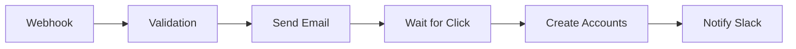

# Workflow Coordination System

This document describes the production-grade coordination system for managing n8n workflows and agent task handoffs using GitHub Issues.

## Architecture Overview

```
┌─────────────────────────────────────────────────────────────────┐
│ PUBLIC REPOSITORY (bpm-agency-agents)                           │
│ - Agent definitions and personalities (MD files)                │
│ - Documentation, guidelines, best practices                     │
│ - NO production workflows or secrets                            │
└─────────────────────────────────────────────────────────────────┘
                              ↓
┌─────────────────────────────────────────────────────────────────┐
│ PRIVATE REPOSITORY (company-specific-workflows)                 │
│ - Production n8n workflows (JSON)                               │
│ - GitHub Issues for task coordination                           │
│ - Environment templates (.env.example)                          │
│ - MCP Server configurations                                     │
│ - Execution logs and metrics                                    │
└─────────────────────────────────────────────────────────────────┘
                              ↓
┌─────────────────────────────────────────────────────────────────┐
│ N8N INSTANCE                                                     │
│ - Running workflows                                             │
│ - Real-time executions                                          │
│ - Automatic backup → Git repository                             │
└─────────────────────────────────────────────────────────────────┘
```

## Required Components

### 1. Private Workflow Repository Setup

**Directory Structure:**
```
company-workflows/
├── .github/
│   └── workflows/
│       ├── validate-n8n-workflows.yml
│       └── issue-automation.yml
├── .claude/
│   ├── agents/                    # Copied agent definitions
│   │   ├── n8n/
│   │   │   ├── n8n-orchestrator.md
│   │   │   ├── n8n-solution-architect.md
│   │   │   ├── n8n-developer.md
│   │   │   ├── n8n-tester.md
│   │   │   ├── n8n-reverse-prompt-developer.md
│   │   │   └── n8n-runbook-rollout-manager.md
│   │   └── [other agents as needed]
│   └── mcp-servers/
│       ├── github-mcp-config.json
│       └── n8n-mcp-config.json
├── workflows/
│   ├── customer-onboarding/
│   │   ├── webhook-receiver.json
│   │   └── email-notification.json
│   ├── data-processing/
│   └── integrations/
├── docs/
│   ├── workflow-architecture.md
│   └── agent-handoff-template.md
├── .env.example
└── README.md
```

### 2. Required MCP Servers

The system requires two MCP servers to be configured:

#### GitHub MCP Server
- **Purpose**: Create and manage GitHub Issues for agent coordination
- **Capabilities**:
  - Create issues with structured templates
  - Add labels, milestones, assignees
  - Link issues with dependencies
  - Comment on issues for status updates
  - Search and filter issues

#### n8n MCP Server
- **Purpose**: Interact with n8n instance for workflow management
- **Capabilities**:
  - List and retrieve workflows
  - Validate workflow configurations
  - Trigger workflow executions
  - Monitor execution status
  - Backup workflows to Git

**Configuration Location:** `~/.config/claude/mcp_settings.json` or `.claude/mcp-servers/`

### 3. n8n Backup Workflow (Required)

**Purpose:** Automatically backup all n8n workflows to the private Git repository

**Workflow Requirements:**
- **Trigger**: Schedule (every 6 hours) or manual
- **Process**:
  1. Fetch all workflows from n8n instance via API
  2. Export each workflow as JSON file
  3. Organize by category (as defined in workflow tags)
  4. Commit changes to Git repository via GitHub API
  5. Create summary comment on tracking issue

**Implementation:** Will be documented in separate guide

---

## GitHub Issues-Based Agent Coordination

### Why GitHub Issues Instead of MD Files?

**Current Problem:**
- Agent definitions exist as MD files (good for personality/capabilities)
- Task handoffs happen ad-hoc or via external systems
- No structured tracking of: Who did what? When? What's blocked?

**Solution: GitHub Issues as Task Queue**
- Each issue = one specific task for one agent
- Issues chain together via dependencies
- Complete audit trail with timestamps
- Native project management (boards, milestones)
- Integrates with both GitHub MCP and n8n MCP

### Issue Template Structure

```markdown
---
name: Agent Task Handoff
about: Template for agent-to-agent task coordination
title: "[AGENT_NAME] Task Title"
labels: agent:AGENT_NAME, status:ready, type:workflow
assignees: ''
---

## 🎯 Task Context

**Parent Issue:** #XX (previous agent's work)
**Next Issue:** #YY (will be created after completion)
**Related Workflow:** `workflows/category/workflow-name.json`
**n8n Workflow ID:** `wf_abc123`

## 📋 Requirements

- [ ] Requirement 1
- [ ] Requirement 2
- [ ] Requirement 3

## 🎨 Deliverables

**Expected Outputs:**
1. Updated workflow JSON file
2. Documentation (if applicable)
3. Test results (if testing phase)

**Quality Criteria:**
- Criterion 1
- Criterion 2

## 🔄 Agent Handoff Chain

```
Issue #44 (orchestrator) → Issue #45 (backend-architect) → Issue #46 (senior-workflow)
                             ↑ YOU ARE HERE
```

## 📊 Success Metrics

- [ ] Metric 1 achieved
- [ ] Metric 2 achieved

## 💬 Agent Communication

_This section will be updated by agents as they work on the task_

---

**Labels:**
- `agent:AGENT_NAME` (e.g., `agent:orchestrator`)
- `status:ready|in-progress|blocked|review|done`
- `priority:low|medium|high|critical`
- `type:workflow|bugfix|optimization|documentation`
- `n8n-workflow` (if related to n8n workflow)

**Milestone:** Quarter or project name
**Project:** Kanban board for visualization
```

### Issue Lifecycle

```
1. CREATED (by orchestrator or previous agent)
   ↓
2. READY (all dependencies resolved)
   ↓
3. IN_PROGRESS (agent actively working)
   ↓
4. REVIEW (deliverables ready for validation)
   ↓
5. DONE (validated, next issue created)
```

### Orchestrator Workflow

The **n8n-orchestrator** agent manages the complete pipeline:

**Example Orchestration:**
```
1. Receive request: "Build customer onboarding automation"
2. Break down into agent tasks:
   Issue #100: [orchestrator] Define requirements and architecture
   Issue #101: [backend-architect] Design webhook authentication
   Issue #102: [senior-workflow] Implement main workflow logic
   Issue #103: [tester] Validate under load and edge cases
   Issue #104: [orchestrator] Deploy to production

3. Create Issue #100, start work
4. Upon completion of #100 → Create Issue #101 with context
5. Monitor #101 progress via GitHub API
6. Continue chain until final deployment
```

**Orchestrator Responsibilities:**
- Create initial issue breakdown
- Monitor dependencies (GitHub Issue API)
- Create next issue when previous completes
- Handle blockers and escalations
- Validate final delivery

---

## Advantages of This System

### ✅ Complete Traceability
```
$ gh issue list --label "agent:orchestrator"
#100  [orchestrator] Customer onboarding requirements  CLOSED  2024-03-15
#104  [orchestrator] Deploy onboarding to production   CLOSED  2024-03-20
#108  [orchestrator] Payment gateway requirements      OPEN    2024-03-21
```

Every decision, handoff, and change is permanently recorded.

### ✅ Dependency Management
```yaml
Issue #102: "Implement workflow logic"
  depends_on: #101 (authentication must be ready)
  blocks: #103 (testing can't start until this is done)
```

GitHub natively supports issue dependencies and blocking relationships.

### ✅ Automated Workflows
```yaml
# .github/workflows/issue-automation.yml
on:
  issues:
    types: [closed]

jobs:
  create-next-task:
    if: contains(github.event.issue.labels.*.name, 'agent:backend-architect')
    steps:
      - name: Create follow-up issue for next agent
        uses: actions/github-script@v7
        # Create Issue for senior-workflow agent
```

GitHub Actions can auto-create follow-up issues, notify agents, update project boards.

### ✅ Integration with n8n
```javascript
// In n8n workflow: "When issue labeled 'needs-deployment' is closed"
// → Trigger deployment workflow
// → Update issue with deployment status
// → Create monitoring issue for next 24h
```

n8n workflows can react to GitHub webhooks (issue events) and vice versa.

### ✅ Security & Privacy
- Private repository keeps workflows confidential
- Public repository shares agent personalities with community
- Secrets managed via GitHub Secrets (for automation) or external vault
- Granular access control per collaborator

---

## Disadvantages & Mitigations

### ⚠️ Issue Overhead for Small Tasks

**Problem:** Creating issue for trivial 5-minute fix is overhead

**Mitigation: Hybrid Approach**
- **Issues**: For agent handoffs, multi-step workflows, production changes
- **Direct commits**: For typos, documentation updates, minor tweaks
- **Rule**: If task requires >1 agent or affects production workflow → Issue required

### ⚠️ Issue Pollution

**Problem:** Hundreds of issues make important ones hard to find

**Mitigation: Structured Labels & Projects**
```bash
# Find critical active tasks
gh issue list --label "priority:critical" --label "status:in-progress"

# Find all tasks for specific workflow
gh issue list --label "workflow:customer-onboarding"

# Archive completed issues older than 30 days
gh issue list --state closed --search "closed:<2024-02-15" --json number \
  | jq -r '.[].number' | xargs -I {} gh issue comment {} -b "Archived"
```

### ⚠️ Large Workflow JSON in Issues

**Problem:** n8n workflow JSON can be 10,000+ lines

**Mitigation: Reference Files**
```markdown
## Workflow Reference
File: `workflows/customer-onboarding/main-workflow.json`
Commit: abc123f
n8n ID: wf_xyz789

View diff: https://github.com/org/repo/compare/main...feature-branch
```

Issue contains **reference** to workflow file, not full JSON.

### ⚠️ Backup Workflow Complexity

**Problem:** Frequent n8n changes = messy Git history

**Mitigation: Smart Backup Strategy**
- **Scheduled backup**: Every 6 hours to `backup/auto` branch
- **Manual backup**: When agent completes task → commit to `main`
- **Squash commits**: Weekly consolidation of auto-backups
- **Change detection**: Only commit if workflow actually changed

---

## Implementation Steps

### Step 1: Create Private Workflow Repository

```bash
# Using GitHub MCP
gh repo create company-workflows --private --description "n8n workflow coordination"
cd company-workflows

# Initialize structure
mkdir -p workflows/{customer-onboarding,data-processing,integrations}
mkdir -p .github/workflows
mkdir -p .claude/{agents,mcp-servers}
mkdir -p docs

# Copy agent definitions from public repo
cp -r /path/to/bpm-agency-agents/n8n .claude/agents/
# Optional: Copy other agents as needed
# cp -r /path/to/bpm-agency-agents/{engineering,testing,design} .claude/agents/

# Add README and templates
cat > README.md << 'EOF'
# Company n8n Workflows

Private repository for production workflow management and agent coordination.

**DO NOT** commit secrets or credentials. Use `.env.example` as template.

## Agent Definitions
Agent personalities are copied to `.claude/agents/` for local Claude Code integration.
EOF

git add .
git commit -m "Initial repository structure with agent definitions"
git push
```

### Step 2: Configure Issue Labels

```bash
# Create agent labels
gh label create "agent:orchestrator" --color "0052CC" --description "n8n Orchestrator"
gh label create "agent:backend-architect" --color "0052CC"
gh label create "agent:senior-workflow" --color "0052CC"
gh label create "agent:tester" --color "0052CC"
gh label create "agent:reverse-prompt" --color "0052CC"

# Create status labels
gh label create "status:ready" --color "28A745" --description "Ready to start"
gh label create "status:in-progress" --color "FBCA04" --description "Currently working"
gh label create "status:blocked" --color "D73A4A" --description "Blocked by dependency"
gh label create "status:review" --color "6F42C1" --description "Ready for review"
gh label create "status:done" --color "28A745" --description "Completed"

# Create priority labels
gh label create "priority:critical" --color "B60205"
gh label create "priority:high" --color "D93F0B"
gh label create "priority:medium" --color "FBCA04"
gh label create "priority:low" --color "0E8A16"

# Create type labels
gh label create "type:workflow" --color "C5DEF5"
gh label create "type:bugfix" --color "D73A4A"
gh label create "type:optimization" --color "1D76DB"
gh label create "type:documentation" --color "D4C5F9"

# Special label
gh label create "n8n-workflow" --color "FF6D5A" --description "Involves n8n workflow"
```

### Step 3: Create Issue Templates

```bash
mkdir -p .github/ISSUE_TEMPLATE

cat > .github/ISSUE_TEMPLATE/agent-task.md << 'EOF'
---
name: Agent Task Handoff
about: Template for agent-to-agent task coordination
title: "[AGENT] Task title"
labels: status:ready
assignees: ''
---

## 🎯 Task Context
**Parent Issue:** #
**Related Workflow:** `workflows/category/name.json`
**n8n Workflow ID:**

## 📋 Requirements
- [ ] Requirement 1

## 🎨 Deliverables
1.

## 🔄 Agent Handoff Chain
Previous: #XX (agent-name) → **Current: YOU** → Next: #YY (agent-name)

## 📊 Success Metrics
- [ ] Metric 1

---
**Labels:** agent:NAME, priority:medium, type:workflow, n8n-workflow
EOF

git add .github/
git commit -m "Add agent task issue template"
git push
```

### Step 4: Create First Orchestrator Issue

```bash
gh issue create \
  --title "[orchestrator] Initialize workflow coordination system" \
  --label "agent:orchestrator,status:ready,priority:high" \
  --body "$(cat <<'EOF'
## 🎯 Task Context
First task in new coordination system. Set up infrastructure for agent-based workflow development.

## 📋 Requirements
- [ ] Verify GitHub MCP server connection
- [ ] Verify n8n MCP server connection
- [ ] Create workflow directory structure
- [ ] Document agent handoff process

## 🎨 Deliverables
1. Directory structure in place
2. Test issue chain (3 issues)
3. Documentation for team

## 📊 Success Metrics
- [ ] All agents can read/write issues via GitHub MCP
- [ ] n8n workflows can trigger from issue events
- [ ] First workflow deployed through issue-based coordination

## 💬 Next Steps
Upon completion, create Issue #2 for backend-architect to design authentication flow.
EOF
)"
```

### Step 5: Implement n8n Backup Workflow

**Architecture:**
```
┌──────────────┐      API        ┌──────────────┐
│ n8n Instance │ ←──────────────→ │ n8n Backup   │
│              │  Get Workflows   │ Workflow     │
└──────────────┘                  └──────┬───────┘
                                         │
                                  GitHub API
                                         ↓
                                  ┌──────────────┐
                                  │ Git Repo     │
                                  │ workflows/*  │
                                  └──────────────┘
```

**Workflow Name:** `n8n-workflow-backup-to-git`

**Nodes Required:**
1. **Schedule Trigger** - Every 6 hours
2. **n8n API: List Workflows** - Get all workflows
3. **Loop Over Items** - Process each workflow
4. **n8n API: Get Workflow Details** - Full JSON per workflow
5. **Function: Organize by Category** - Determine target directory from tags
6. **GitHub API: Get Current File** - Check if file exists and get SHA
7. **Function: Detect Changes** - Compare old vs new JSON
8. **GitHub API: Create/Update File** - Commit only if changed
9. **GitHub API: Create Issue Comment** - Log backup summary

**Implementation:** [Will be documented in separate guide with full workflow JSON]

---

## Example: Complete Agent Coordination Flow

### Scenario: Build Customer Onboarding Automation

**Request:** "We need automated customer onboarding with email verification and Slack notifications"

### Issue Chain

```
Issue #200: [orchestrator] Plan customer onboarding automation
  ↓ creates
Issue #201: [backend-architect] Design webhook authentication and data flow
  ↓ creates
Issue #202: [senior-workflow] Implement n8n workflow with error handling
  ↓ creates
Issue #203: [tester] Validate workflow with 1000 test customers
  ↓ creates (if issues found)
Issue #204: [senior-workflow] Fix issues identified in testing
  ↓ creates
Issue #205: [tester] Re-validate fixes
  ↓ creates
Issue #206: [orchestrator] Deploy to production and create monitoring
```

### Issue #200 Details

```markdown
Title: [orchestrator] Plan customer onboarding automation

Labels: agent:orchestrator, status:in-progress, priority:high, type:workflow

## 🎯 Task Context
**Request:** Automated customer onboarding with email verification and Slack notifications
**Business Goal:** Reduce onboarding time from 2 hours to 5 minutes
**Expected Volume:** 100 new customers/day

## 📋 Requirements Analysis

### Functional Requirements
- [ ] Accept new customer data via webhook
- [ ] Validate email format and domain
- [ ] Send verification email with unique token
- [ ] Wait for verification (max 24h)
- [ ] Create accounts in CRM and billing systems
- [ ] Send welcome package to Slack channel
- [ ] Notify sales team of completion

### Non-Functional Requirements
- [ ] Response time: <2 seconds
- [ ] Success rate: >99%
- [ ] Email delivery: <1 minute
- [ ] Secure token generation (cryptographically random)

## 🎨 Deliverables

1. **Architecture Diagram** (Mermaid)


2. **Issue Breakdown**
   - Issue #201: Authentication (backend-architect)
   - Issue #202: Core workflow (senior-workflow)
   - Issue #203: Testing (tester)

3. **Success Criteria Document**

## 🔄 Agent Handoff Chain
**START** → #200 (orchestrator) → #201 (backend-architect) → ...

## 📊 Success Metrics
- [ ] All issues created with proper dependencies
- [ ] Each issue has clear acceptance criteria
- [ ] Timeline estimated: X days

## 💬 Agent Notes
_Orchestrator will update this section with findings and decisions_

---

**Milestone:** Q1-2024-Customer-Experience
**Project:** Customer Onboarding Automation
```

### Issue #201 Details (Created after #200 closes)

```markdown
Title: [backend-architect] Design webhook authentication and data flow

Labels: agent:backend-architect, status:ready, priority:high, type:workflow, n8n-workflow

## 🎯 Task Context
**Parent Issue:** #200 (orchestrator completed requirements)
**Related Workflow:** `workflows/customer-onboarding/main.json` (will be created)
**Requirements Doc:** See #200

## 📋 Requirements
Based on #200 analysis:
- [ ] Webhook accepts POST requests with customer data
- [ ] Authentication: HMAC signature validation
- [ ] Rate limiting: 1000 requests/hour per API key
- [ ] Data validation: email, name, company required
- [ ] Error responses: Proper HTTP codes and messages

## 🎨 Deliverables

1. **Authentication Design**
   - HMAC algorithm choice (e.g., SHA-256)
   - Signature header format
   - Key rotation strategy

2. **Data Schema**
```json
{
  "customer": {
    "email": "string (required, valid email)",
    "name": "string (required, 2-100 chars)",
    "company": "string (required)",
    "phone": "string (optional, E.164 format)"
  },
  "metadata": {
    "source": "string (required)",
    "referral_code": "string (optional)"
  }
}
```

3. **Error Handling Strategy**
   - Invalid signature → 401
   - Invalid data → 400 with details
   - Rate limit → 429 with retry-after
   - Server error → 500 + retry logic

4. **Architecture Diagram** (Updated with security details)

## 🔄 Agent Handoff Chain
#200 (orchestrator) → #201 (backend-architect) → #202 (senior-workflow)
                       ↑ YOU ARE HERE

## 📊 Success Metrics
- [ ] Authentication design reviewed and approved
- [ ] Data schema validated against all downstream systems
- [ ] Error handling covers all edge cases
- [ ] Documentation complete for senior-workflow agent

## 💬 Agent Notes
_Backend architect will document design decisions here_

---

**Next Issue:** #202 for senior-workflow will be created when this closes
**Depends On:** #200
**Blocks:** #202
```

### Issue Closing Flow

When backend-architect completes #201:

```bash
# Backend architect (or orchestrator monitoring) closes issue
gh issue close 201 --comment "Design complete. Key decisions:
- HMAC-SHA256 with header X-Webhook-Signature
- Rate limit: 1000/hour with Redis counter
- JSON schema validation via Ajv library
- Comprehensive error codes documented

Creating Issue #202 for senior-workflow implementation."

# Orchestrator automatically creates next issue (via GitHub Action or manual)
gh issue create \
  --title "[senior-workflow] Implement customer onboarding workflow" \
  --label "agent:senior-workflow,status:ready,priority:high,type:workflow,n8n-workflow" \
  --body "$(cat <<'EOF'
## 🎯 Task Context
**Parent Issue:** #201 (backend-architect completed auth design)
**Related Workflow:** `workflows/customer-onboarding/main.json`
**n8n Workflow ID:** (will be assigned upon creation)

## 📋 Requirements
Implement n8n workflow based on designs from #200 and #201.

See #201 for:
- Authentication requirements (HMAC-SHA256)
- Data schema
- Error handling strategy

### Workflow Steps
1. Webhook Trigger (POST /webhook/customer-onboarding)
2. Validate HMAC signature
3. Validate JSON schema
4. Rate limit check
5. Send verification email
6. Wait for verification (webhook callback or timeout)
7. Create CRM account (HTTP Request to CRM API)
8. Create billing account (HTTP Request to Billing API)
9. Send Slack notification
10. Error handling at each step

## 🎨 Deliverables
1. Complete n8n workflow JSON
2. Committed to: `workflows/customer-onboarding/main.json`
3. Tested locally with sample data
4. Documentation of any deviations from architecture

## 🔄 Agent Handoff Chain
#201 (backend-architect) → #202 (senior-workflow) → #203 (tester)
                           ↑ YOU ARE HERE

## 📊 Success Metrics
- [ ] Workflow created in n8n instance
- [ ] JSON backed up to Git repository
- [ ] Manual test passed with valid data
- [ ] Manual test passed with invalid signature (returns 401)
- [ ] Manual test passed with invalid data (returns 400)
- [ ] Ready for comprehensive testing

## 💬 Agent Notes
_Senior workflow specialist will document implementation here_

---
**Depends On:** #201
**Blocks:** #203
EOF
)"
```

---

## Best Practices

### 1. Issue Naming Convention
```
[agent-name] Verb + Object + Context

Good examples:
- [orchestrator] Plan customer onboarding automation
- [backend-architect] Design webhook authentication flow
- [senior-workflow] Implement payment processing workflow
- [tester] Validate onboarding under 1000 concurrent users

Bad examples:
- Fix bug (which agent? which bug?)
- Update workflow (which workflow? what changes?)
- Testing (too vague)
```

### 2. Always Link Parent Issues
Every issue except the first should reference parent issue:
```markdown
**Parent Issue:** #200
```

This creates a traceable chain.

### 3. One Issue = One Agent = One Workflow File
```
Good:
  Issue #201 → backend-architect → auth design → workflow/onboarding/main.json

Bad:
  Issue #201 → backend-architect + senior-workflow → multiple workflows
```

Keep issues focused and single-responsibility.

### 4. Use GitHub Projects for Visualization
Create Kanban board with columns:
- Backlog
- Ready (dependencies met)
- In Progress
- Review
- Done

Automatically move issues based on labels.

### 5. Comment Frequently During Work
```markdown
## 💬 Agent Notes

**2024-03-15 10:30** - Started authentication design. Considering OAuth2 vs HMAC.

**2024-03-15 14:20** - Decision: HMAC-SHA256. OAuth2 adds unnecessary complexity for webhook validation.

**2024-03-15 16:45** - Completed design. Rate limiting will use Redis with sliding window algorithm.
```

This creates detailed audit trail.

### 6. Attach Evidence to Issues
```markdown
## Deliverables

1. Architecture Diagram: 
2. Performance Test Results: See attached `load-test-results.json`
3. n8n Workflow Screenshot: 
```

Use issue attachments for screenshots, diagrams, test results.

---

## Comparison: MD Files vs GitHub Issues

| Aspect | MD Files | GitHub Issues |
|--------|----------|---------------|
| **Agent Definitions** | ✅ Perfect (personality, capabilities) | ❌ Too heavyweight |
| **Task Coordination** | ❌ No tracking, no dependencies | ✅ Native support |
| **Audit Trail** | ❌ Only via Git history | ✅ Built-in with timestamps |
| **Dependencies** | ❌ Manual tracking | ✅ GitHub Issues linking |
| **Search & Filter** | ❌ Manual grep | ✅ Powerful query syntax |
| **Automation** | ❌ Limited | ✅ GitHub Actions + n8n |
| **Collaboration** | ✅ Git workflow | ✅ Comments + mentions |
| **Persistence** | ✅ Files in repo | ✅ GitHub database |

**Recommended Hybrid:**
- **Agent definitions** → MD files (personality, workflows, deliverables)
- **Task coordination** → GitHub Issues (work items, handoffs, status)
- **Workflow files** → JSON in Git (actual n8n workflows)

---

## Integration with MCP Servers

### GitHub MCP Examples

```javascript
// Create agent handoff issue
const issue = await github.create_issue({
  owner: "company",
  repo: "workflows",
  title: "[backend-architect] Design webhook auth",
  body: issueTemplate,
  labels: ["agent:backend-architect", "status:ready", "priority:high"]
})

// Monitor issue status
const issues = await github.search_issues({
  query: "repo:company/workflows is:open label:status:in-progress"
})

// Close issue and create next
await github.add_issue_comment({
  owner: "company",
  repo: "workflows",
  issue_number: 201,
  body: "Design complete. Creating next issue for senior-workflow."
})

await github.issue_write({
  method: "update",
  owner: "company",
  repo: "workflows",
  issue_number: 201,
  state: "closed"
})
```

### n8n MCP Examples

```javascript
// Get workflow details for issue
const workflow = await n8n.n8n_get_workflow({
  id: "wf_abc123"
})

// Create issue comment with workflow status
await github.add_issue_comment({
  issue_number: 202,
  body: `Workflow Status:
- Active: ${workflow.active}
- Last Updated: ${workflow.updatedAt}
- Nodes: ${workflow.nodes.length}
- View: ${n8nBaseUrl}/workflow/${workflow.id}`
})

// Validate workflow and report in issue
const validation = await n8n.validate_workflow({
  workflow: workflowJson
})

if (!validation.valid) {
  await github.add_issue_comment({
    issue_number: 202,
    body: `⚠️ Validation Failed:\n${validation.errors.map(e => `- ${e}`).join('\n')}`
  })
}
```

### Combined Workflow

```javascript
// Orchestrator monitoring pipeline
async function monitorPipeline(startIssueNumber) {
  let currentIssue = startIssueNumber

  while (currentIssue) {
    // Check issue status
    const issue = await github.get_issue({
      owner: "company",
      repo: "workflows",
      issue_number: currentIssue
    })

    if (issue.state === "open") {
      console.log(`Waiting for issue #${currentIssue}...`)
      await sleep(300000) // Check every 5 minutes
      continue
    }

    // Issue closed, find next in chain
    const nextMatch = issue.body.match(/Next: #(\d+)/)
    if (nextMatch) {
      currentIssue = parseInt(nextMatch[1])
    } else {
      // No next issue defined, check if we should create one
      const agent = issue.labels.find(l => l.name.startsWith('agent:'))?.name.split(':')[1]
      const nextAgent = getNextAgent(agent)

      if (nextAgent) {
        // Create next issue
        const nextIssue = await github.create_issue({
          owner: "company",
          repo: "workflows",
          title: `[${nextAgent}] ${generateNextTitle(issue)}`,
          body: generateNextBody(issue),
          labels: [`agent:${nextAgent}`, "status:ready"]
        })

        currentIssue = nextIssue.number
      } else {
        // Pipeline complete
        console.log("Pipeline complete!")
        break
      }
    }
  }
}
```

---

## Summary

This coordination system provides:

✅ **Complete Traceability** - Every decision logged in GitHub Issues
✅ **Structured Handoffs** - Clear agent-to-agent task delegation
✅ **Dependency Management** - Native GitHub issue linking
✅ **Automation Ready** - GitHub Actions + n8n webhooks
✅ **Security** - Private repo for workflows, public repo for agent definitions
✅ **MCP Integration** - Both GitHub MCP and n8n MCP fully utilized
✅ **Scalability** - Handles simple tasks to complex multi-agent pipelines

The system maintains the best aspects of both approaches:
- Agent personalities remain in versioned MD files
- Task coordination happens through structured GitHub Issues
- n8n workflows are automatically backed up to Git
- Complete audit trail for compliance and debugging

**Next Steps:**
1. Create private workflow repository
2. Configure GitHub and n8n MCP servers
3. Set up issue labels and templates
4. Implement n8n backup workflow
5. Create first orchestrator issue to test system
